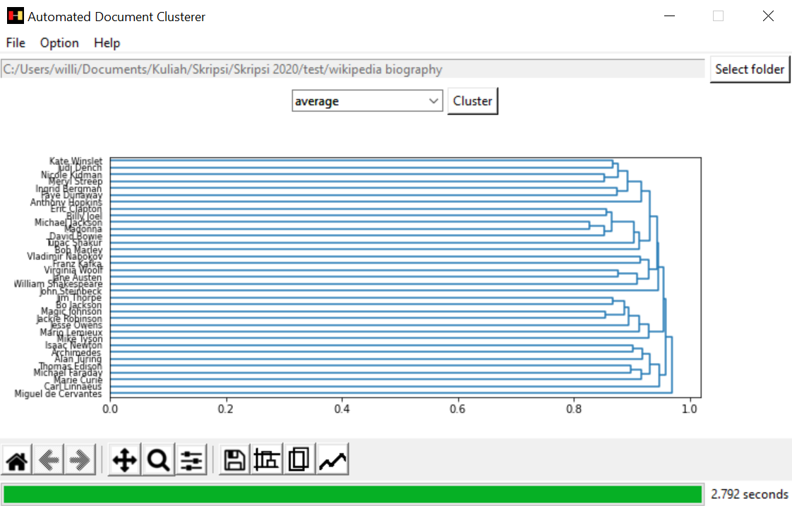

# Automated Document Clusterer

Automated Document Clusterer is a simple application built on Python to automatically cluster a bunch of documents. The application does have some features.
* Automatically cluster your document files based on contents of each documents. Algorithm used is agglomerative hierarchical clustering and the output is a dendrogram that can be cut at a certain height.
* Automatically organize your document files based on clustering result. Each clusters will have a folder and each document files will be put in the corresponding cluster folder.
* Automatically rename clusters get from the clustering result.
* Evaluate the clustering result by using cophenetic correlation coefficient.
* Save an inverted index which indexes your document files and can be used and updated in the future.

    

## Dependencies

* [SciPy](https://www.scipy.org/)
* [Matplotlib](https://www.matplotlib.org/)
* [NLTK](https://www.nltk.org/)

## Lincense

Distributed under the MIT Lincese. See `LICENSE` for more information.